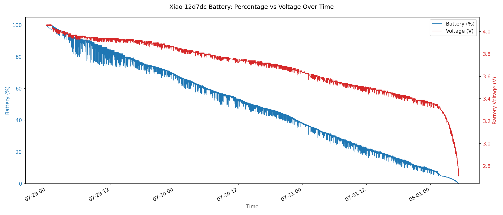

# HA MQTT Auto-Discovered Device


## Battery Discharge Monitoring

Charged 750mAh battery and monitored the battery voltage level to create a valid percent status.  




Created code block to update the battery percent using piecewise table:

```c++
/*
 * battery_percent.ino
 * -------------------
 * Piecewise-linear State-of-Charge (SoC) estimate for a single-cell (1S) LiPo.
 *
 * A LiPo's voltage-vs-charge curve is NOT linear: it drops fast near full,
 * stays fairly flat through the middle, then drops fast again near empty.
 * A single linear map (e.g. 3.3V=0%, 4.2V=100%) is therefore quite wrong in
 * the middle of the range. This function interpolates between calibration
 * points instead, which tracks the real curve much better.
 *
 * This table was DERIVED FROM A REAL FULL DISCHARGE of the target cell
 * (750 mAh 1S LiPo, ~4.12 V down to 2.69 V over ~81 h). State-of-charge was
 * estimated by treating charge drawn as proportional to elapsed time, i.e.
 * assuming a roughly constant average load. 100% is anchored at the cell's
 * charged resting voltage (~4.04 V), not the textbook 4.20 V.
 *
 * Note: these reflect the voltage UNDER THIS SETUP'S LOAD. If your runtime
 * load differs a lot from the logging load the mid-curve will shift. Read the
 * battery under similar conditions for the most accurate result.
 *
 * SAFETY: 0% here is 2.75 V, which is BELOW the safe ~3.0 V LiPo cutoff (the
 * cell was intentionally run flat to capture the full curve). For a gauge that
 * protects the cell, change the first entry to {3300, 0} so anything at/below
 * 3.30 V reads 0% and you stop discharging there.
 */

#include <Arduino.h>

// Calibration table: voltage (mV) -> percent. MUST be sorted ascending by mV.
// Derived from a measured 750 mAh 1S LiPo full discharge (see header).
struct SocPoint { uint16_t mV; uint8_t pct; };

const SocPoint SOC_TABLE[] = {
  {2745,   0}, {3310,   5}, {3380,  10}, {3430,  15}, {3480,  20},
  {3520,  25}, {3560,  30}, {3610,  35}, {3660,  40}, {3700,  45},
  {3740,  50}, {3760,  55}, {3800,  60}, {3830,  65}, {3870,  70},
  {3910,  75}, {3930,  80}, {3940,  85}, {3950,  90}, {3990,  95},
  {4040, 100}
};
const uint8_t SOC_TABLE_LEN = sizeof(SOC_TABLE) / sizeof(SOC_TABLE[0]);

/*
 * Return battery percentage (0-100) for a given cell voltage in VOLTS.
 * Uses linear interpolation between the two nearest table points.
 */
float batteryPercent(float volts) {
  uint16_t mV = (uint16_t)(volts * 1000.0f + 0.5f);   // volts -> millivolts

  // Clamp to the ends of the table.
  if (mV <= SOC_TABLE[0].mV)                return 0.0f;
  if (mV >= SOC_TABLE[SOC_TABLE_LEN - 1].mV) return 100.0f;

  // Find the segment [i, i+1] that contains mV, then interpolate.
  for (uint8_t i = 0; i < SOC_TABLE_LEN - 1; i++) {
    const SocPoint &lo = SOC_TABLE[i];
    const SocPoint &hi = SOC_TABLE[i + 1];
    if (mV >= lo.mV && mV <= hi.mV) {
      float frac = (float)(mV - lo.mV) / (float)(hi.mV - lo.mV);
      return lo.pct + frac * (hi.pct - lo.pct);
    }
  }
  return 0.0f;  // unreachable
}

// ---------------------------------------------------------------------------
// Example usage
// ---------------------------------------------------------------------------

// If you read the battery through a resistor divider on an ADC pin, convert
// the raw ADC count to cell volts here. Adjust for your board & divider.
const int   BATT_PIN   = A0;
const float ADC_REF    = 3.30f;   // ADC full-scale reference voltage
const int   ADC_MAX    = 4095;    // 12-bit ADC (use 1023 for 10-bit AVR)
const float DIVIDER    = 2.0f;    // (R1+R2)/R2, e.g. two equal resistors = 2.0

float readCellVoltage() {
  int raw = analogRead(BATT_PIN);
  return ((float)raw / ADC_MAX) * ADC_REF * DIVIDER;
}

void setup() {
  Serial.begin(115200);
}

void loop() {
  float v   = readCellVoltage();
  float pct = batteryPercent(v);

  Serial.print("Voltage: ");
  Serial.print(v, 3);
  Serial.print(" V   Battery: ");
  Serial.print(pct, 1);
  Serial.println(" %");

  delay(2000);
}

```

