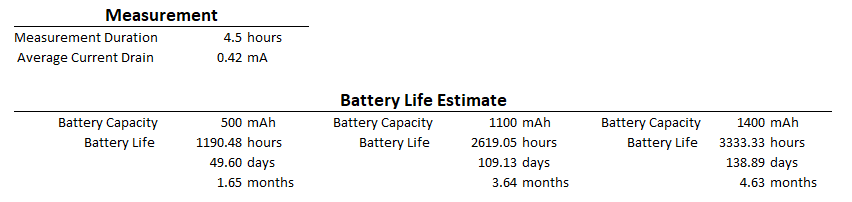

# Updates

- Replace 1M ohm resistor divide with ADC sampling the LiPo battery voltage with MAX17048


# Optimized Power Consumption


Measured power consumption using: [Nordicsemi Power Profiler Kit II](https://www.nordicsemi.com/Products/Development-hardware/Power-Profiler-Kit-2?utm_feeditemid=&utm_device=c&utm_term=&utm_source=google&utm_medium=ppc&utm_campaign=Pmax+%7C+Wi-Fi+%7C+US&hsa_cam=23209587568&hsa_grp=&hsa_mt=&hsa_src=x&hsa_ad=&hsa_acc=1116845495&hsa_net=adwords&hsa_kw=&hsa_tgt=&hsa_ver=3&gad_source=1&gad_campaignid=23205419936&gbraid=0AAAAADPygHKE249kvEkCFHpIwqwcQRX6R&gclid=Cj0KCQjw8JPVBhD-ARIsAO691sGCzfeTsiXcdaOZih7sJOIVBkbTrOFTAz_e2_6d2WZJurihPmhoIAkaArdKEALw_wcB)

Temperature Sensor Parameters:

```c++
#define UPDATE_RATE_SEC     300
#define uS_TO_SEC_FACTOR    1000000ULL

// Ground Pin D3 and reboot to stop deep sleep (for re-flashing).
// Holding it LOW also forces discovery configs to be re-published.
#define MONITOR_PIN D3 // GPIO21

#define WIFI_FAST_TIMEOUT_MS    5000
#define WIFI_FULL_TIMEOUT_MS    20000

//#define LOG_LEVEL LOG_LEVEL_VERBOSE
#define LOG_LEVEL LOG_LEVEL_SILENT


// Publish only when the temperature differs from the LAST PUBLISHED value
// by at least this many degrees. Comparing against the last published value
// (not the previous wake's reading) means a slow drift of, say, 0.1 degree
// per wake still gets reported once it adds up to the threshold.
//
// The unit follows USE_FAHRENHEIT: 0.5 means 0.5 F when USE_FAHRENHEIT is
// true, and 0.5 C (= 0.9 F) if you switch to Celsius. For an equivalent
// Celsius threshold use ~0.28.
//
// Don't go much below ~0.1: the SHT31's reading-to-reading noise would then
// start waking the radio on its own.
#define TEMP_CHANGE_DEG         0.5f

// Force a publish after this many consecutive wakes without one, so HA
// still receives humidity / battery updates and the entities don't expire
// while the temperature is stable.  15 wakes x 60 s = every 15 minutes.
// Set to 0 to publish ONLY on temperature change (entities then never expire).
#define HEARTBEAT_WAKES         6

// Entities expire in HA if no update within this window (seconds).
// With report-on-change the longest normal gap is one heartbeat interval,
// so allow 3 heartbeats to tolerate a couple of missed cycles.
// NOTE: HA only learns a new value when discovery is re-sent (first
// power-on after flashing, or hold D3 LOW during boot).
#if HEARTBEAT_WAKES > 0
  #define EXPIRE_AFTER_SEC (UPDATE_RATE_SEC * HEARTBEAT_WAKES * 3)
#else
  #define EXPIRE_AFTER_SEC 0   // 0 = never expire
#endif

// Force the fuel gauge into hibernate mode before deep sleep (23uA -> ~3uA).
// The MAX17048 already hibernates on its own once the charge rate drops below
// its hibernation threshold (default 5%/hr), which a sleeping sensor always
// does, so leave this false unless you want the gauge parked immediately.
// Forcing it costs a little SoC-tracking resolution right after each wake.
#define MAX17048_FORCE_HIBERNATE  true
```


**Goal**: Last 1 year on 500mAh LiPo battery

**Results**:




### Measurement Notes:

- MAX17048 device wasn't in hibernate mode by default, which was a constant 24uA drain.
- MAX17048 now consumes 4uA during hibernate, 24uA during operation
- Connecting to WiFi was is 1.6 seconds on average, but did observe WiFi taking as long as 6 second to connect.