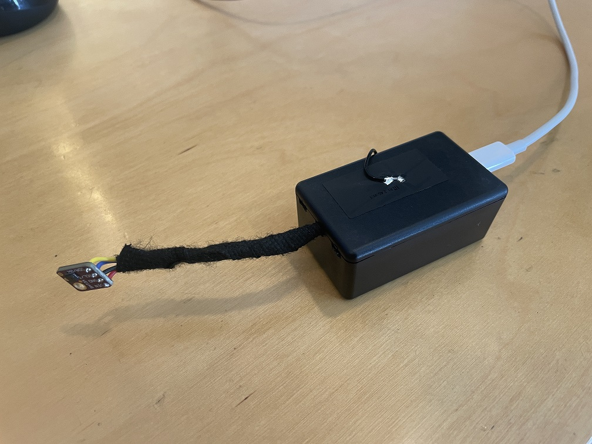
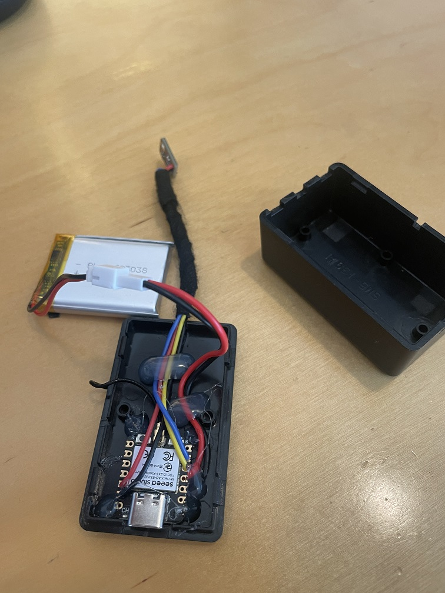

# XIAO MQTT Battery Temperature and Humidity Sensor





Source: https://wiki.seeedstudio.com/XIAO_ESP32C3_Getting_Started/

[ESP32-C3 Datasheet](./doc/esp32-c3_datasheet.pdf)


## XIAO ESP32C3 Wiring

### Temperature and Humidity Sensor (SHT-31-D) Device


| Pin          | Description |
| ------------ | ----------- |
| SDA/GPIO6/D4 | SDA         |
| SCL/GPIO7/D5 | SCL         |
| 3v3          | Power       |
| GND          | Ground      |

### Battery Life Reading

Used 300Kohm resistors in series with the ADC A0 attached to the voltage divider circuit.  Read the voltage

Source: https://forum.seeedstudio.com/t/battery-voltage-monitor-and-ad-conversion-for-xiao-esp32c/267535


## Battery Testing

### 750mAh Battery Test

| Parameter Description                  | Value        |
| -------------------------------------- | ------------ |
| Battery Capacity                       | 750 mAh      |
| Device Consumption During MQTT Message | 278 mA       |
| Device Consumption Idle                | 28 mA        |
| Transmit Duration                      | 10 ms        |
| Device Idle Duration                   | 990 ms       |
| Estimated Battery Life                 | 20.517 hours |


### 1400mAh Battery Test

| Parameter Description                  | Value      |
| -------------------------------------- | ---------- |
| Battery Capacity                       | 1400 mAh   |
| Device Consumption During MQTT Message | 278 mA     |
| Device Consumption Idle                | 28 mA      |
| Transmit Duration                      | 10 ms      |
| Device Idle Duration                   | 990 ms     |
| Estimated Battery Life                 | 38.3 hours |


## Measuring Message Duration

Measured duration to send the MQTT message including the following lines of code:

```c
    Serial.print("Message Time: ");
    Serial.print(message_time);
    Serial.println(" ms");
```

Just uncomment the lines of code at the end of the `if` statement, and it should be around `80 ms`.

```bash
Message Time: 82 ms
Message Time: 78 ms
Message Time: 73 ms
Message Time: 77 ms
Message Time: 77 ms
Message Time: 82 ms
Message Time: 83 ms
Message Time: 81 ms
Message Time: 72 ms
Message Time: 78 ms
Message Time: 77 ms
Message Time: 79 ms
Message Time: 76 ms
Message Time: 77 ms
Message Time: 75 ms
Message Time: 74 ms
Message Time: 75 ms
```

