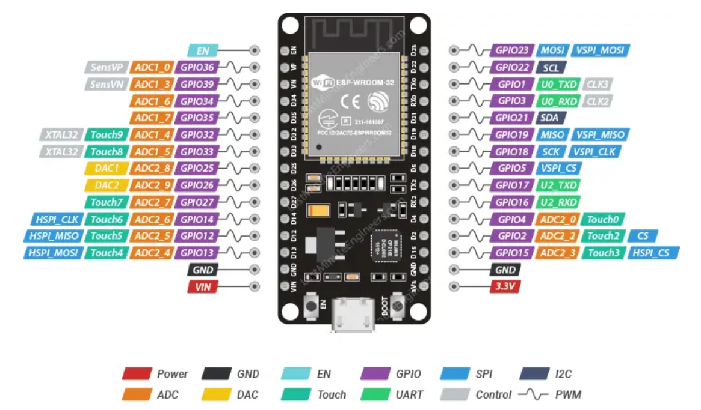
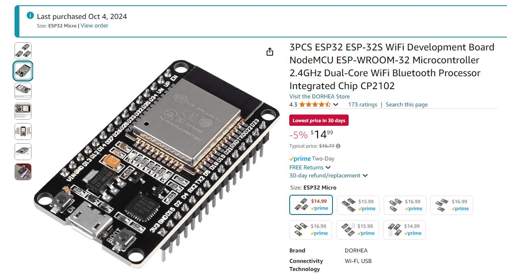
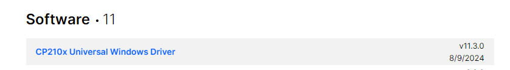
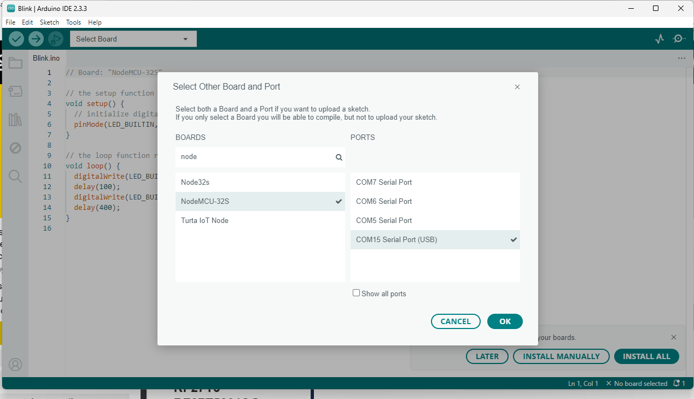
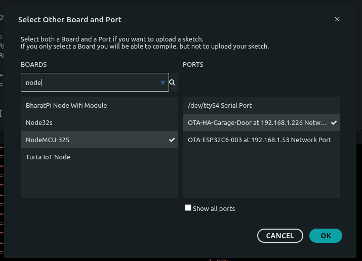

# NodeMCU-32S Pin Mapping



| Sensor Pin                 | NodeMCU-32S Pin |
| -------------------------- | --------------- |
| UltraSonic HC-SR-04 `Vcc`  | VIN (5.0V)      |
| UltraSonic HC-SR-04 `Trig` | GPIO12          |
| UltraSonic HC-SR-04 `Echo` | GPIO13          |
| UltraSonic HC-SR-04 `Gnd`  | GND             |
| SHT-31D `Vin`              | 3.3V            |
| SHT-31D `GND`              | GND             |
| SHT-31D `SCL`              | SCL             |
| SHT-31D `SDA`              | SDA             |


# NodeMCU-32S System Setup	

Cheap ESP-32S Development board.  This was purchased on Amazon for ~$5 each, pack of 3 boards cost $14.99 shipped to my house.

Link to Amazon:

https://www.amazon.com/dp/B086MJGFVV?ref=ppx_yo2ov_dt_b_fed_asin_title&th=1




## Install Driver

Needed to install the USB CP210x driver:

https://www.silabs.com/developers/usb-to-uart-bridge-vcp-drivers?tab=downloads





Unzipped folder, and plug in the NodeMCU-32S board into my computer.   Under Device Manager, I selected the board, right clicked to update driver.  I just pointed Windows to the unzipped folder and Windows selected the correct driver.


### Program NodeMCU-32S with Blinking LED Firmware

#### Source Code

```c++
// Board: "NodeMCU-32S"

// the setup function runs once when you press reset or power the board
void setup() {
  // initialize digital pin LED_BUILTIN as an output.
  pinMode(LED_BUILTIN, OUTPUT);
}

// the loop function runs over and over again forever
void loop() {
  digitalWrite(LED_BUILTIN, HIGH);  // turn the LED on (HIGH is the voltage level)
  delay(100);                      // wait for a second
  digitalWrite(LED_BUILTIN, LOW);   // turn the LED off by making the voltage LOW
  delay(400);                      // wait for a second
}
```

#### Arduino IDE Board Selection

This is for USB connection.




#### OTA Updates

The Garage sensor firmware can be updated OTA, just select `OTA-HA-Garage-Door`



# HA Configuration

## Template

Paste the below into `sensors.yaml` to configure the Garage sensor.

```yaml
- platform: template
  sensors:
    garage_status:
      friendly_name: Garage Door Status
      unique_id: "029309823409"
      value_template: >-
        
          Garage Open
        
          Garage Closed
        
      icon_template: >-
        
          mdi:garage-open
        
          mdi:garage
        

```


## Automations

### Garage Notify Open for Longer than 5 minutes

```yaml
alias: Garage Door
description: ""
triggers:
  - entity_id:
      - sensor.garage_door_status
    for:
      hours: 0
      minutes: 5
      seconds: 0
    above: 0
    below: 20
    trigger: numeric_state
conditions: []
actions:
  - action: notify.mobile_app_everetts_iphone_12
    data:
      message: Garage Door Open
  - action: notify.mobile_app_bri_s
    data:
      message: Garage Door Open
  - repeat:
      sequence: []
      count: 5
mode: single
```

