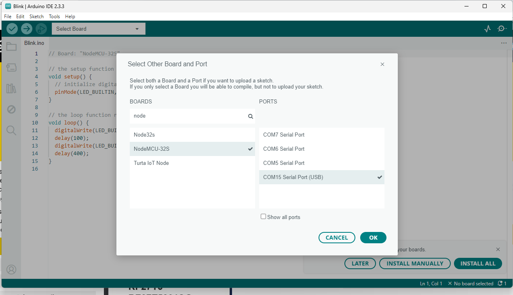

# NodeMCU-32S Pin Mapping


| Sensor Pin                 | NodeMCU-32S Pin |
| -------------------------- | --------------- |
| UltraSonic HC-SR-04 `Vcc`  | VIN (5.0V)      |
| UltraSonic HC-SR-04 `Trig` | GPIO12          |
| UltraSonic HC-SR-04 `Echo` | GPIO13          |
| UltraSonic HC-SR-04 `Gnd`  | GND             |
| SHT-31D `Vin`              | 3.3V            |
| SHT-31D `GND`              | GND             |
| SHT-31D `SCL`              | SCL             |
| SHT-31D `SDA`              | SDA             |


# NodeMCU-32S System Setup	

Cheap ESP-32S Development board.  This was purchased on Amazon for ~$5 each, pack of 3 boards cost $14.99 shipped to my house.

Link to Amazon:

https://www.amazon.com/dp/B086MJGFVV?ref=ppx_yo2ov_dt_b_fed_asin_title&th=1


## Install Driver

Needed to install the USB CP210x driver:

https://www.silabs.com/developers/usb-to-uart-bridge-vcp-drivers?tab=downloads


Unzipped folder, and plug in the NodeMCU-32S board into my computer.   Under Device Manager, I selected the board, right clicked to update driver.  I just pointed Windows to the unzipped folder and Windows selected the correct driver.


### Program NodeMCU-32S with Blinking LED Firmware

#### Source Code

```c++
// Board: "NodeMCU-32S"

// the setup function runs once when you press reset or power the board
void setup() {
  // initialize digital pin LED_BUILTIN as an output.
  pinMode(LED_BUILTIN, OUTPUT);
}

// the loop function runs over and over again forever
void loop() {
  digitalWrite(LED_BUILTIN, HIGH);  // turn the LED on (HIGH is the voltage level)
  delay(100);                      // wait for a second
  digitalWrite(LED_BUILTIN, LOW);   // turn the LED off by making the voltage LOW
  delay(400);                      // wait for a second
}
```

#### Arduino IDE Board Selection




# HA Template

```jinja2

  Garage Open

  Garage Closed

```

