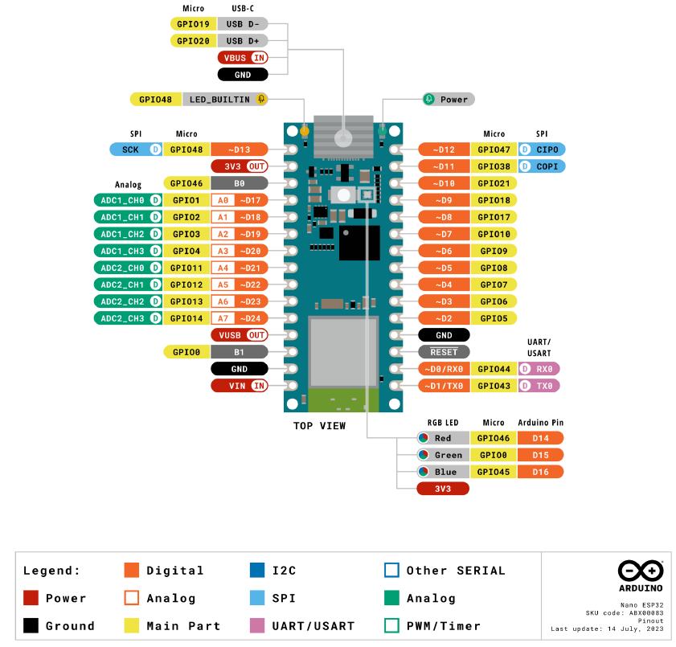
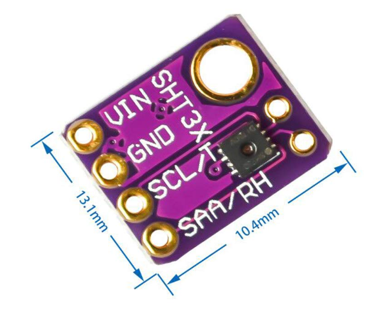

# Main Wine Frig Sensor

Connect the Arduino Nano ESP32 to wall power, so I can send updates every 2 seconds to HA.  Just connected the SHT-31-D Temperature and Humidity sensor to the Nano board.  


### Arduino Nano ESP32 Pin Map




## Temperature and Humidity Sensor - SHT-31D

Data Sheet:  [Datasheet_SHT3x_DIS.pdf](doc\Datasheet_SHT3x_DIS.pdf) 

Arduino Library: https://github.com/RobTillaart/SHT31/releases/tag/0.5.0


### SHT3x & SHT85 Accuracy table

| SENSOR | Temperature | Humidity |
| ------ | ----------- | -------- |
| SHT30  | ~0.3        | 2.0      |
| SHT31  | ~0.3        | 1.5      |
| SHT35  | ~0.2        | 1.5      |
| SHT85  | ~0.2        | 1.5      |




### Connection SHT31-D & Arduino Nano ESP32

| SHT31-D       | Arduino Nano ESP32 |
| ------------- | ------------------ |
| VIN           | 3V3 OUT            |
| GND           | GND                |
| SCL           | A5                 |
| SAA (aka SDA) | A4                 |


## Arduino-Log Library

You can download the Arduino-Log through the Arduino IDE, but you will not be able to take advantage of the `DISABLE_LOGGING` feature.  There seems to be an error in the library when you define `DISABLE_LOGGING`.  I just updated the source code locally, and added to the project rather than a library.

See https://github.com/thijse/Arduino-Log/pull/25/files for details on Error.

```bash
DISABLE_LOGGING Uncommented:
	Sketch uses 727285 bytes (23%) of program storage space. Maximum is 3145728 bytes.
	Global variables use 56936 bytes (17%) of dynamic memory, leaving 270744 bytes for local variables. Maximum is 327680 bytes.

DISABLE_LOGGING Commented LOG_LEVEL_VERBOSE:
	Sketch uses 729525 bytes (23%) of program storage space. Maximum is 3145728 bytes.
	Global variables use 56952 bytes (17%) of dynamic memory, leaving 270728 bytes for local variables. Maximum is 327680 bytes.

DISABLE_LOGGING Commented LOG_LEVEL_SILENT:
	Sketch uses 729525 bytes (23%) of program storage space. Maximum is 3145728 bytes.
	Global variables use 56952 bytes (17%) of dynamic memory, leaving 270728 bytes for local variables. Maximum is 327680 bytes.

```


### Testing LOG_LEVEL_SILENT

Want to test if the program runs faster if `LOG_LEVEL_SILENT` is set on a large print statement.

```c++

  unsigned long time_before_print = millis();
  Log.info("Create a very large print statement....alskdjf;laskjdf;laksdjf;laksjdf;laksjdf;laksjdf;lkjasd;lfkjas;ldfkja;lskjdf;lasjdf;laksjdfl;kjasdf;lkjasd;lfja;sldkjf;alskdjf;laskjdf;laksjdf;lkajsd;lfkjas;lkdjf;lkasjdf;lksadjfl;kjdsa;lfjasdklfjas;dlkjf" CR);
  Serial.print(millis()-time_before_print);
  Serial.println(" ms delta time.");

```

Now I just compiled the program for `LOG_LEVEL_VERBOSE` and `LOG_LEVEL_SILENT`, then recorded the delta time.

| Arduino Log Mode  | Delta Time |
| ----------------- | ---------- |
| LOG_LEVEL_VERBOSE | 7 ms       |
| LOG_LEVEL_SILENT  | 0 ms       |

