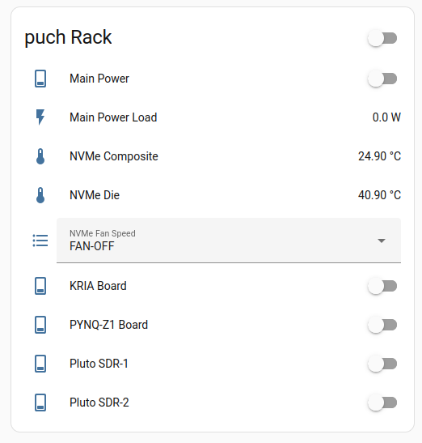

# HA Power Controller for the puch Rack

Information on the puch framework and the rack is found on: https://puch.readthedocs.io


This is the webpage/phone puch power controller for the puch rack.  This is implemented by sending MQTT message to a XIAO ESP32 C3 development board.





The HA-NVMe monitor is integrated in the HA-UI, see the Python device: https://github.com/odelayIO/Home-Assistant-Devices/tree/main/HA_MQTT_NVMe_Temperature


## Building Arduino Firmware

Using the ArduinoMQTTClient library for the MQTT message: https://github.com/arduino-libraries/ArduinoMqttClient


## HA MQTT Configuration

The Home Assistant configuration is controlled by YAML file to define the custom devices.  Copy and paste the following YAML source code into the Home Assistant configuration files.

```yaml

select:
  - name: "Rack Fan Mode"
    state_topic: "puch_rack/status"
    command_topic: "puch_rack/control"
    options:
      - "FAN-OFF"
      - "FAN-LOW"
      - "FAN-MED"
      - "FAN-HIGH"
    qos: 1
    retain: false
    optimistic: false

switch:
  - name: "KRIA Board"
    state_topic: "puch_rack/status"
    command_topic: "puch_rack/control"
    payload_on: "KRIA-ON"
    payload_off: "KRIA-OFF"
    qos: 1
    retain: false
  - name: "PYNQ-Z1 Board"
    state_topic: "puch_rack/status"
    command_topic: "puch_rack/control"
    payload_on: "PYNQZ1-ON"
    payload_off: "PYNQZ1-OFF"
    qos: 1
    retain: false
  - name: "Pluto SDR-1"
    state_topic: "puch_rack/status"
    command_topic: "puch_rack/control"
    payload_on: "PLUTO-1-ON"
    payload_off: "PLUTO-1-OFF"
    qos: 1
    retain: false
  - name: "Pluto SDR-2"
    state_topic: "puch_rack/status"
    command_topic: "puch_rack/control"
    payload_on: "PLUTO-2-ON"
    payload_off: "PLUTO-2-OFF"
    qos: 1
    retain: false

```


## Home Assistant Lovelace UI

Below is the Lovelace UI YAML source code.

```yaml
type: entities
entities:
  - entity: switch.pynq_kria_plug
    name: Main Power
  - entity: sensor.pynq_kria_plug_power
    name: Main Power Load
  - entity: sensor.puch_dev_wks_nvme_temperature
    name: NVMe Composite
  - entity: sensor.puch_dev_wks_nvme_temperature_1
    name: NVMe Die
  - entity: select.rack_fan_mode_2
    name: NVMe Fan Speed
  - entity: switch.kria_board
  - entity: switch.pynq_z1_board
  - entity: switch.pluto_sdr_1
  - entity: switch.pluto_sdr_2
title: puch Rack

```

