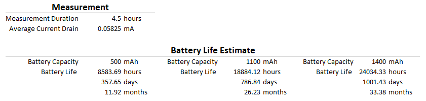

# Merged MQTT to Zigbee End-device

Converted the sketch from WiFi/MQTT to native Zigbee, using the official `ZigbeeTempSensor` endpoint class (Arduino-ESP32 core's Zigbee library, verified against Espressif's `Zigbee_Temp_Hum_Sensor_Sleepy` reference example, which explicitly targets ESP32-C6/H2).

What changed in [HA_Zigbee_MQTT_Batt_Temp_Sensor.ino](vscode-webview://03jjvne9ajfpemnqpnf12amb1bnbbh6etmal4dhrj8fee1p3fdru/HA_Zigbee_MQTT_Batt_Temp_Sensor/HA_Zigbee_MQTT_Batt_Temp_Sensor/HA_Zigbee_MQTT_Batt_Temp_Sensor.ino):

- **Removed**: `ArduinoMqttClient`, `WiFi`/`WiFiClient`, `arduino_secrets.h`, the MAC-derived device ID, MQTT discovery-config JSON builder, and all RTC-cached WiFi reconnect state. No broker, no credentials, no `configuration.yaml` edits.
- **Added**: a Zigbee **sleepy end device** with one endpoint exposing the standard ZCL Temperature Measurement, Relative Humidity Measurement, and Power Configuration (battery) clusters. Home Assistant creates the Temperature/Humidity/Battery entities automatically via ZHA or Zigbee2MQTT.
- **Kept unchanged**: the SHT31 read, the battery-voltage ADC/divider logic, and your full LiPo discharge-curve `SOC_TABLE`/`batteryPercent()` — none of that is protocol-specific.
- **MONITOR_PIN (D3)** now factory-resets the Zigbee stack on release (forces a full rejoin) instead of forcing an MQTT discovery re-publish — same "hold to intervene at boot" pattern, translated to the new protocol.
- Temperature is now always reported in **Celsius** — the ZCL cluster has no Fahrenheit mode; HA converts for display based on the user's profile, so the old `USE_FAHRENHEIT` toggle is gone.

Before building, in Arduino IDE: **Tools → Board**: Seeed XIAO ESP32-C6 (this is the one XIAO board with the 802.15.4 radio Zigbee needs — the ESP32-C3/S3 XIAO boards can't do this). **Tools → Zigbee mode**: "Zigbee ED (end device)". **Tools → Partition Scheme**: "Zigbee 4MB with spiffs".

One thing to flag: `arduino_secrets.h` in that folder is no longer referenced by the sketch, but it still has real-looking WiFi/MQTT/Blynk credentials in it (apparently copied from another project). I left the file alone rather than touch secrets — let me know if you want it deleted or cleared out.

I couldn't compile-check this locally (no `arduino-cli`/PlatformIO installed here), so please do a build/verify in the Arduino IDE before flashing.


# Optimized Power Consumption


Measured power consumption using: [Nordicsemi Power Profiler Kit II](https://www.nordicsemi.com/Products/Development-hardware/Power-Profiler-Kit-2?utm_feeditemid=&utm_device=c&utm_term=&utm_source=google&utm_medium=ppc&utm_campaign=Pmax+%7C+Wi-Fi+%7C+US&hsa_cam=23209587568&hsa_grp=&hsa_mt=&hsa_src=x&hsa_ad=&hsa_acc=1116845495&hsa_net=adwords&hsa_kw=&hsa_tgt=&hsa_ver=3&gad_source=1&gad_campaignid=23205419936&gbraid=0AAAAADPygHKE249kvEkCFHpIwqwcQRX6R&gclid=Cj0KCQjw8JPVBhD-ARIsAO691sGCzfeTsiXcdaOZih7sJOIVBkbTrOFTAz_e2_6d2WZJurihPmhoIAkaArdKEALw_wcB)

Temperature Sensor Parameters:

```c++

#define TIME_TO_SLEEP_SEC 300  // Sleep duration in sec
#define uS_TO_SEC_FACTOR 1000000ULL

// POWER: report-on-change. A wake with no significant change skips the radio.
#define TEMP_DELTA_C 0.5f     // report temperature if it moved this much
#define HUMID_DELTA_PCT 5.0f  // report humidity if it moved this much
// Force a report at least every N wakes, even with no change (3 x 10 min = 30 min).
// Keep this well under the parent's end-device timeout (library default: 64 min),
// otherwise the parent drops the device from its child table.
#define HEARTBEAT_WAKES 6
// POWER: battery changes slowly -- measure/report roughly hourly (6 x 10 min).
#define BATTERY_REPORT_WAKES 12

// POWER: rejoin scan time per channel. Library default is 3 = (2^3+1) x 15.36 ms
// = 138 ms of receiver-on time every wake (the 140 ms idle gap in the PPK2 capture).
// 1 = 46 ms, 2 = 77 ms. If rejoins start failing, change to 2.
#define ZIGBEE_SCAN_DURATION 3

#define ZIGBEE_BEGIN_TIMEOUT_MS 10000
#define ZIGBEE_JOIN_TIMEOUT_MS 10000
// POWER: confirmations normally arrive within ~150 ms. Don't wait 1 s x 3 tries.
#define REPORT_TIMEOUT_MS 500
#define REPORT_RETRIES 1  // one resend of anything unconfirmed

// POWER: on network failure, double the sleep time each attempt, up to this cap.
#define MAX_BACKOFF_SEC 3600

// Ground Pin D3 and reboot to stop before joining (for re-flashing).
// Holding it LOW also factory-resets the Zigbee stack, forcing a full rejoin.
#define MONITOR_PIN D3  // GPIO21

//#define LOG_LEVEL LOG_LEVEL_VERBOSE
#define LOG_LEVEL LOG_LEVEL_SILENT
```


**Goal**: Last 1 year on 500mAh LiPo battery

**Results**:




### Notes:

| Parameter                                         | Measurement    |
| ------------------------------------------------- | -------------- |
| Sleep Consumption                                 | 12.53uA        |
| Wake Duration without Zigbee Update (Avg Current) | 60ms @ 30mA    |
| Wake Duration with Zigbee Update (Avg Current)    | 450ms @ 66.8mA |
| Average Consumption (5 hours)                     | 57.82uA        |

